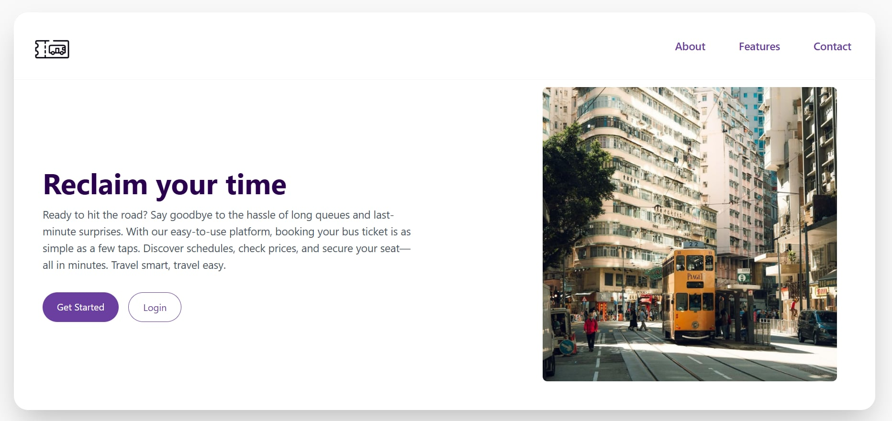
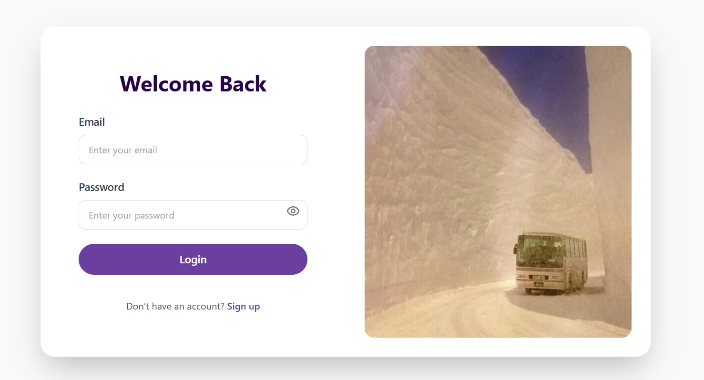

# 🚌 Elite Roadways – Bus Ticket Booking System
Elite Roadways is a comprehensive Bus Ticket Booking System built to streamline the process of managing bus services, seat reservations, ticket generation, and user authentication. It is a full-stack web application tailored for travel agencies and transportation services that want to move beyond manual ticketing.

## 🚀 Overview
Elite Roadways simplifies the entire travel booking process for both administrators and employees, offering modules for:
* Bus scheduling and route management
* Real-time seat booking
* Ticket generation and payment tracking
* Admin control panel with user and route management

It demonstrates efficient handling of transport business logic with a focus on user experience, security, and operational automation.

## 🧩 Core Features
| Feature |	Description |
| ------------- | ------------- |
| 🧑‍💼 Admin Panel |	Add/view/edit bus details, schedules, routes, manage bookings.|
| 👨‍💻 User Portal	| Check available buses, book seats. |
| 🎫 Ticket Management | Get email of bus tickets with details. |
| 📅 Bus Schedule System |	View all buses by date, time, and route. |
|🔐 Secure Login System |	Role-based login with restricted access and session management. |

## 🎯 Problem It Solves
Traditional bus booking systems rely on paper tickets and manual registers, leading to:
* Double-bookings or seat mismatches
* Inefficient route management
* No centralized tracking or reporting
* No ticket history or customer record system
  
Elite Roadways replaces all of this with a clean, automated, and scalable platform that can serve as the foundation for a commercial ticket booking service.

## 📷 Screenshots

### Landing Page

### Register Account Page

### Login Page

### Home Page – Passenger View

### Home Page – Admin View

### Add New Bus (Admin)

### Bus Seat Layout

### Book a Seat

### Booked Seat Details – Admin

### User's Booked Seats

### User Profile Page

### Admin Page – User Details

### eSewa Payment Integration

### Payment Confirmation Email

 
